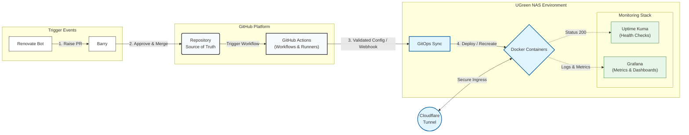

### Hi there, I'm Barry McSorley 👋

**Engineering Director | Head of Platforms | Cloud Strategy Leader**
*Based in Belfast & London*

I am a senior technology leader with over 20 years of experience managing large-scale engineering units and driving DevSecOps transformations.

While my day job involves organisational design and enterprise strategy I believe in maintaining deep technical literacy, so I run my personal infrastructure using the same **GitOps** and **IaC** principles I mandate for my engineering teams as it helps me understand the challenges and benefits it can accrue.

---

### 🛠️ The Tech Stack (Home & Professional)
    

---

### 🔭 Current "Home Lab" Architecture
I recently migrated my self-hosted environment from a UI-based management model (Portainer/Watchtower) to a strictly declarative **GitOps model**.

* **Infrastructure:** UGreen 2800DXP NAS (Docker).
* **Orchestration:** Docker Compose managed via Git version control.
* **Dependency Management:** Automated via **Renovate** (PR-based workflow using MEND license) to ensure stability before updates. PR's assessed daily by me - generally merged if minor update, research if major. Per app/container Database normally left as is for stability.
* **Networking:** Cloudflare Reverse Proxy & Tunnels. Tailscale for remote secure access.

CI/CD Workflow Logic: To prevent configuration drift or syntax errors from breaking the production environment, I utilise GitHub Actions Runners.

Validation: Every PR triggers a workflow that lints the docker-compose.yml files and verifies schema compliance.

Security: MEND/Renovate scans for vulnerable dependencies, ensuring the stack remains secure by design.

Deployment: Only after the workflow passes (Green Build) is the code merged to main, where the NAS pulls the validated state.
